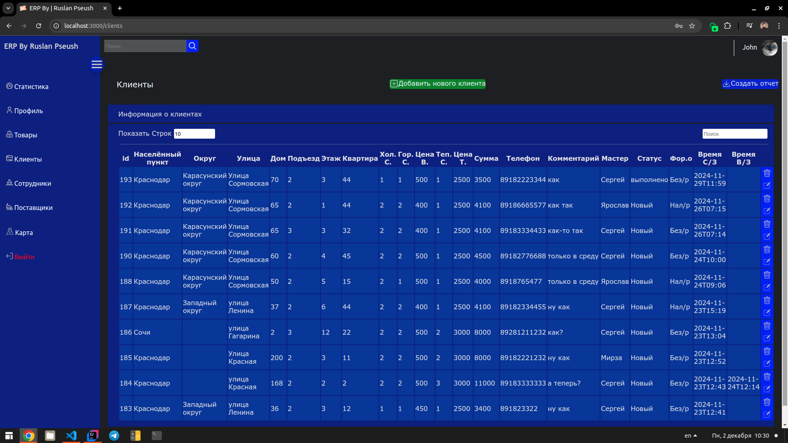

# ERP (Enterprise Resource Planning) System

## General info
This system (RESTful API) facilitates the management of suppliers, employees, customers, and products. Only authorized users with a rank of at least Employee have access to its functionality. Managers can generate detailed reports on products, customers, suppliers, and more, which can be exported to PDF files. User account creation is restricted to administrators for enhanced security.

The system features a global map displaying orders: Employee-level users see only their own orders, while Admin and Manager users have access to all orders. It also includes advanced order statistics within specific time intervals, either for all employees or a particular employee, with detailed statuses for each order. Additionally, the system offers financial reporting for the company or individual employees, showing cash and non-cash payment amounts, company revenue, net profit, and employee salaries.

## ERP System User Interface

## Front-End
- Reactjs
- Leaflet
- Chart.js
- React router dom

## Back-End
- Java 17
- Spring Boot (Data, Security, MVC)
- JWT Authentication
- MySQL 8
- iTextPDF

## Features
- Export data to PDF files.
- Manage information about customers, suppliers, employees, and products.
- Secure user account registration, restricted to administrators.
- Enhanced security using JWT authentication.
- Interactive world map for quick navigation and order viewing, with automatic call functionality for orders.
- Detailed order statistics, including statuses and counts, for all employees or specific individuals.
- Comprehensive financial reports covering payment methods, company revenue, employee salaries, and net profit.
